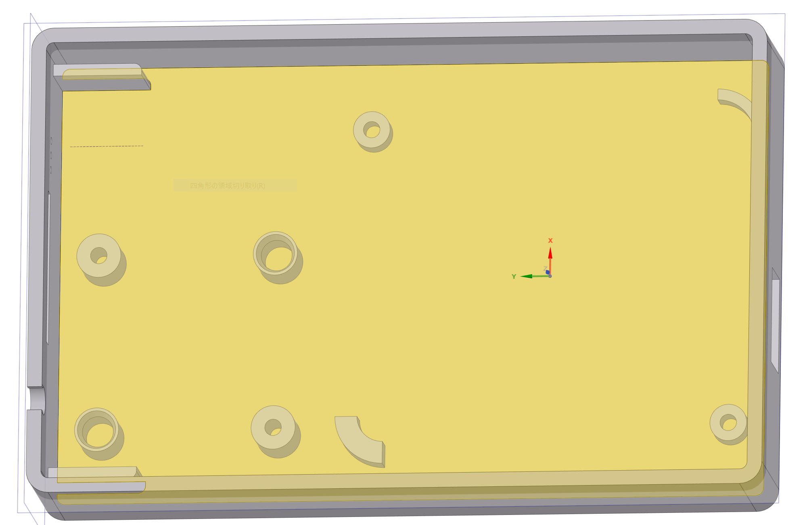
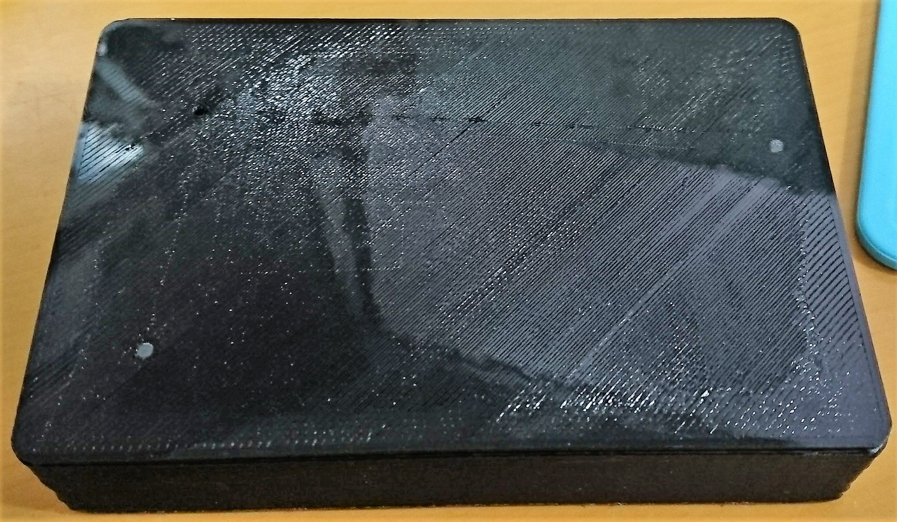
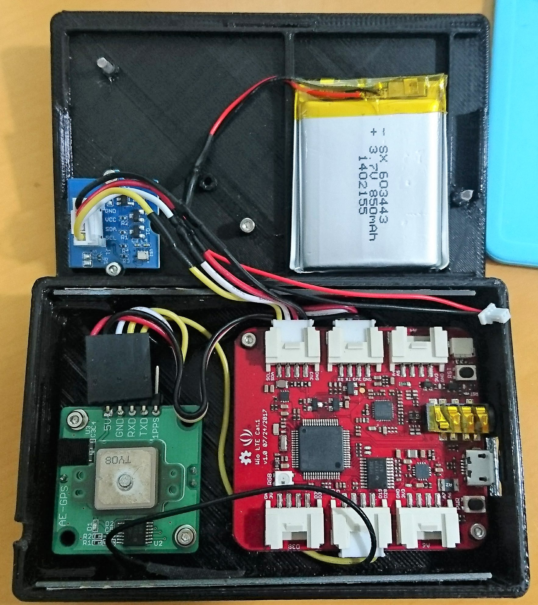
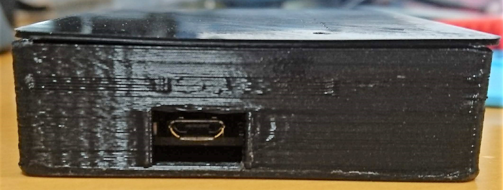

# Wio LTE GPS トラッカー用 エンクロージャー

## 概要

* Wio LTE と秋月で買えるGPSモジュールを使ったGPSトラッカー用のエンクロージャー

* 秋月のAE-GPSモジュール (要レギュレータ取り外し3.3V化改造)
    * 接続用ケーブルはGroveケーブルを切って作成
        * Grove側は2個 (PPS入力GPIO, UARTのTX,RX, GND)
* aitendoで買ったLi-Poバッテリー (要コネクタ変更)
* 何かしらのGroveモジュール
    * 写真はオムロンの絶対圧センサ

* 側面にUSBポート用開口部あり

## 内容

* Design Spark Mechanical 4.0用の設計データ
* 3Dプリンタ出力用STL

| 内容 | 形式 |
|:-----|:------|
| 全体 | [Design Spark Mechanical](WioLTE_GPS_Enclosure.rsdoc) |
| 上蓋 | [STL](WioLTE_GPS_Enclosure_Top.stl) |
| 本体 | [STL](WioLTE_GPS_Enclosure_Bottom.stl) |

## 確認環境

* PrintrBot Simple Metal with Heat Bed
* Cura 4.0
* Pxmalion PLA 1.75 Black

## ライセンス
 Wio LTE GPS Enclosure by <a xmlns:cc="http://creativecommons.org/ns#" href="https://github.com/ciniml/M5Stack_Gadgets/OuterCover/" property="cc:attributionName" rel="cc:attributionURL">Kenta IDA</a> is licensed under a <a rel="license" href="http://creativecommons.org/licenses/by/4.0/">Creative Commons Attribution 4.0 International License</a>.
